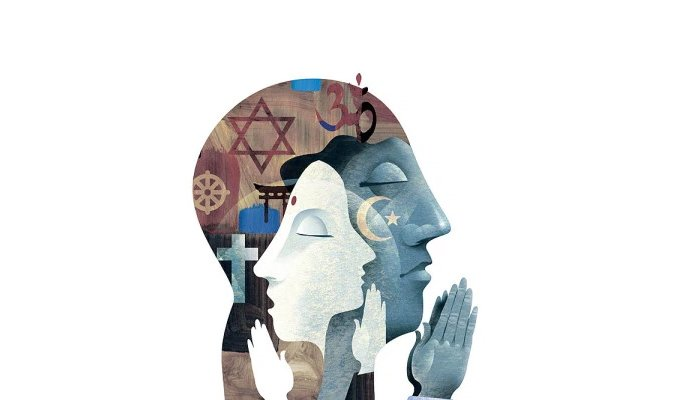

You may have seen overloaded feeds of news about the inhumane terror attacks in
Paris all over social media recently, along with certain revolting comments
against a particular religion. Those people who are responsible for such kinds
of criticisms might not have realized the fact that the instinct of terrorism
could be disguised under any kind of religion or skin color. The reality is that
Paris’ tragic event, genuinely has nothing to do with any religious ideologies,
but rather with irreligious terrorism. This can be seen if we untie the knot of
our delusive cynicism.

Due to the acts of terrorism, mostly caused by a group of armed militants who
are so-called ISIS, and unambiguously outsiders of Islam, wearing masks and
defaming Islam, have been often taking place across the world, the entire
Islamic community is dismissively affected and suspected to be responsible for
all their devastating activities. In the meantime, people have gotten the wrong
impression of Islam by considering ISIS as radical Muslims and, it is a pain in
the neck to see, as it becomes antagonism towards Islam.

Today, our incorrect mental mindset is due for an enhancement of issues. Allow
me to elucidate you. There are many political and religious groups which have
been misapplied to the concept of Jihad, to justify different forms of violence,
and such abuses of Jihad definitely contradict Islam. But, with the media’s use
of propaganda and the lack of knowledge keeping us away from the truth, people
have recklessly misunderstood Islam. People believe what they want and are told
to believe and, once they believe in it, they would go against anything against
their beliefs. This is just a spontaneous principle of human beings. Thus, the
media has simply perceived that weakness of us and has taken the benefit out of
it. Not only does Islam suffer from propaganda, but so too does Buddhism as
well.

Criticism without knowledge always leads to controversial disagreement, and, as
a consequence, grudges are formed and held. I’m not trying to promote any
religion by my remarks here. I am pushing forward to endeavor against defamation
of religion, ignorant criticism and terrorism. As his Holiness, the 14th Dalai
Lama said,

>   “Religion is **the creation of man** and the problems arising out of it is
>   for the human beings to solve.”

>   “I know nothing about Economy, but I can say something about peace and it
>   can only be achieved through **dialogue and education**.” he added.

Hence, if it is true that we are seeking for peace regardless of language, skin
color, or religion, we must adapt ourselves to compassion and knowledge, to
become healthy-minded people, so that we can distinguish true from false. As a
result, of course, the real truth that terrorism and religion do not believe the
same thing, and never relate to each other, can be seen with the naked eye.
