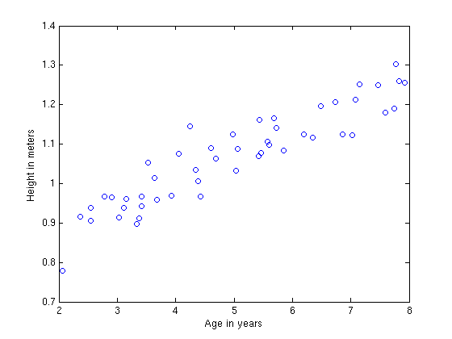
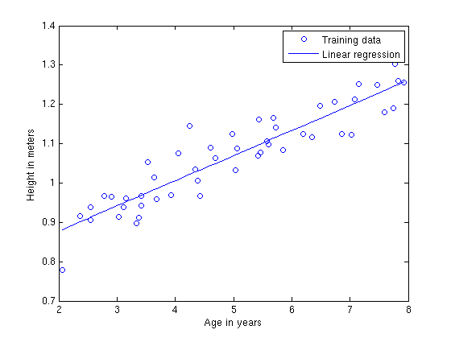

Artificial Intelligence (AI) သို့မဟုတ် မြန်မာဘာသာစကားဖြင့် “တုပဖန်တီးထားသော ဥာဏ်ပညာ”
“ဥာဏ်တု”ဟု အဓိပွါယ်ဖွင့်ဆိုနိုင်သည့် ကွန်ပျူတာ သိပွံပညာရပ်ခွဲတစ်ခုသည် ယခု ကျွနု်ပ်တို့
နေ့စဥ်လှုပ်ရှားသွားလာနေထိုင်နေသော IT ခေတ်ကြီးတွင် တနေ့ထက်တနေ့ အလွန်အရေးပါလှသော
အခန်းကဏ္ဍမှ သိသိသာသာ နေရာယူလာသည့်အလျောက် မရှိမဖြစ်လိုအပ်လာသည်။ AI စနစ်တို့ဖြင့် လူသားတိုင်း
အမှုမဲ့ အမှတ်မဲ့ ထိတွေ့နေရသော ကာလဖြစ်သည်။ Apple၏ iOS အသုံးပြုသူများသည် Siri ဟုခေါ်သော AI
စနစ် တစ်ခုဖြင့် အသားကျနေသကဲ့သို့ Google၏ Android device အသုံးပြုသူများသည်လည်း Google Now
ဟုခေါ်သော AI စနစ်ဖြင့် အကျွမ်းတဝင်ရှိနေပြီးဖြစ်သည်။ ၄င်း AI စနစ်တို့​ကြောင့် လူသားတို့၏
နေ့စဥ်လူနေမှုဘဝ သက်တောင့်သက်သာဖြင့် ပိုမိုအဆင်ပြေချောမွေ့လာစေသည်။ မိမိ သိလိုသည်များကို smart
device များတွင် တိုက်ရိုက် ရိုက်သွင်းစရာ မလိုတော့ဘဲ နှုတ်ဖြင့် မေးမြန်းရုံဖြင့် စက္ကန့်ပိုင်း
အတွင်း သင့်တော်ဆီလေျာ်မှန်ကန်စွာ ​ဖြေကြားပေးနိုင်သည်။ အဘယ်ကြောင့်ဆိုသော် ယင်း AI
စနစ်တို့သည် လူသားအချင်းချင်း ဆက်သွယ်ရာတွင် အသုံးပြုသော ဘာသာစကားတို့ကို လူကဲ့သို့ မြင်ရုံ၊ ကြားရုံဖြင့်
နားလည်နှိုင်စွမ်းရှိခြင်းဖြစ်သည်ဟုပင် ဆိုရပေမည်။ ဤကဲ့သို့ ကွန်ပျူတာတစ်လုံးအား
စဥ်းစားတွေးခေါ်တတ်စေရန် သင်ကြားပေးသည့် အတတ်ပညာကို တနည်းအားဖြင့် Machine
Learningဟုလည်းဆိုပေသည်။ အလားတူပင် အင်တာနက်မှ စျေးဝယ်ရာတွင်လည်း မိမိ
ကြိုက်နှစ်သက်ဖွယ်ရှိသည့် ကုန်ပစ္စည်းများကို စျေးဝယ်သူ တစ်ဦးချင်းစီ၏ အကြိုက်ကိုလိုက်၍ အလိုအလျောက်
recommendation/suggestion များအနေဖြင့် ကြေငြာပေးသည့် စနစ်များသည်လည်း AI agent
များပင်ဖြစ်သည်။ မိုးလေဝသခန့်မှန်းချက်များ တွက်ချက်ရာမှာ အစ၊ Facebook တွင် မိမိနှင့်
သိကျွမ်းရင်းနှီးဖွယ်ထင်ရလောက်သည့် မိတ်ဆွေများကို အလိုအလျောက် Friend suggestion အနေဖြင့်
အကြံပြုပေးသည့်စနစ်အဆုံး AI agents များပင်ဖြစ်သည်။ AI ၏ အဓိကရည်ရွယ်ချက်မှာ
မေးခွန်း/ပုစ္ဆာ/ပြသနာတစ်ခုကို နားလည်သဘောပေါက်၍ ယင်းပြသနာနှင့် ဆီလျော်မှန်ကန်သော
အ​ဖြေ/တုံ့ပြန်မှုတစ်ခုကို အနီးစပ်ဆုံး မှန်မှန်ကန်ကန် ပြန်လည်​ဖြေကြားပေးနိုင်စေရန်ဖြစ်သည်။
ဤသည်မှာ လူသားတို့ နေ့စဥ်ထိတွေ့နေရသော တုပဖန်တီးပြုလုပ်ထားသော Artificial Intelligence
ဟုခေါ်သော ပညာရပ်တစ်ခု၏ အကျဥ်းဖြစ်သည်။

 

Neural Network ၏ နိယာမ
---------------------

ယနေ့ စာရေးသူမှ ၄င်းAIစနစ် သို့မဟုတ် လူသားတစ်ယောက်ကဲ့သို့ တွေးခေါ်တတ်စေရန် ကွန်ပျူတာအား
သင်ကြားရာတွင် အသုံးပြုလေ့ရှိသော စနစ်များထဲမှ တစ်ခုဖြစ်သည့် Artificial Neural
Network(ANN) ဟုဆိုသော စနစ်တစ်ခုကို အလွယ်ကူဆုံး ရှင်းလင်းသွားမည်ဖြစ်သည်။ ANN သည် လူသားတို့၏
ဦးနှောက်အတွင်း Neurons များ တခုနှင့် တခု ချိတ်ဆက် သတင်းပို့ ဆက်သွယ်မှုကို အတုယူ
ဖန်တီးထားခြင်းသာဖြစ်သည်။ လူ့ဦးနှောက် အလုပ်လုပ်ပုံကို အ​ခြေခံပြီး ကွန်ပျူတာများအား လူကဲ့သို့
စဥ်းစားတွေးခေါ်တတ်စေရန် သင်ကြားပို့ချပေးသောစနစ်တစ်ခုဖြစ်သည်။ Neural Network တစ်ခုတွင်
neurons များနှင့် ၄င်းတို့အချင်းချင်း ဆက်သွယ်ပေးသော synapses များ ပါဝင်သည်။ Neuron
တစ်ခုသည် ၄င်း၏ dendritesများမှ input signal ကို လက်ခံရရှိ၍ output signal ကို ၄င်း၏ axon
မှတဆင့် ထုတ်လုပ်ပေးသည်။ ယင်းaxonမှတဖန် ခွဲဖြာဖြန့်ကျက်၍ တခြား neuron ၏ dendrite သို့
synapseမှတဆင့် ဆက်သွယ်ကူးလျှက်ခြင်းဖြင့် neuron တခုနှင့်တခု ဆက်သွယ်လုပ်ဆောင်ကြသည်။
ဦးနှောက်တွင်းရှိ neuron တစ်ခု၏ လုပ်ဆောင်ပုံမှာ အောက်ဖော်ပြပါ ပုံ(၁)အတိုင်းဖြစ်သည်။

**ပုံ(၁) ဦးနှောက်တွင်းရှိ Neuron တစ်လုံး၏ လုပ်ဆောင်ပုံ**

 

ပုံ(၂)တွင်ကား ဦးနှောက်တွင်းရှိ neuronများ အချင်းချင်း ချိတ်ဆတ် အလုပ်လုပ်ပုံကို
တုပတီထွင်ထားသော Neural Network ၏ ဝိသေသဖြစ်သည်။ ဤဝိသေသ၏ ဖြစ်တည်မှုသဘောတရားနှင့်
လုပ်ဆောင်ချက်များကို တဆင့်ချင်း ရှင်းပြသွားမည်ဖြစ်သည်။

**ပုံ(၂) Neural Network ၏ ဝိသေသ**

 

Neural Network တစ်ခုတွင် Input Layer, Hidden Layer နှင့် Output Layer ဆို၍ အလွှာ
၃လွှာဖြင့် ဖွဲ့စည်းတည်ဆောက်ထားသည်။ Input layer သည်ကား မေးခွန်း/ပုစ္ဆာတစ်ခုအတွက်
ဖြေကြားရန် လိုအပ်သော အချက်အလက်တချို့ကို လက်ခံရရှိသည့် အလွှာဖြစ်သည်။ ဥပမာအားဖြင့်ဆိုသော်
ကျောင်းသားတစ်​ေယာက်၏ စာကြည့်ချိန်နှင့် အိပ်ချိန်ပေါ်မူတည်၍ နောက်တနေ့ စာမေးပွဲ​ဖြေဆိုရာတွင်
ရရှိနိုင်မည့် အမှတ်စာရင်းကို တွက်ချက်ရန် ထိုကျောင်းသား၏ စာကြည့်ချိန်နှင့် အိပ်ချိန် နှစ်ခုသည်
အမှတ်စာရင်းအား ခန့်မှန်းရာတွင် လိုအပ်သော အချက်အလက်ဖြစ်သည်။ ထို့ကြောင့် ကျောင်းသား၏
စာကြည့်ချိန်နှင့် အိပ်ချိန်ကို Input layer တွင် ထည့်သွင်းရမည်။ Hidden Layer ဆိုသည်ကား
Input layer နှင့် Output layer ကြားတွင် ရှိပြီး ယင်းတို့ရဲ့ လုပ်ဆောင်ချက်များသည် အဓိက
အချက်ချာကျသော်လည်း ထိန်ချန်ကွယ်မြှပ်ထားသောကြောင့် hidden (ကွယ်မြုပ်နေသော) အလွှာဟု
ခေါ်ဝေါ်ထားခြင်းဖြစ်သည်။ Hidden layer ၏ လုပ်ဆောင်ချက်မှာ Input layer နှင့် Output
layer တို့အကြား ဆက်နွယ်မှုကို လိုက်လျောညီထွေစွာ တွက်ချက် အဖြေဖော်ထုတ်ပေးခြင်းဖြစ်သည်။
ယင်းလုပ်ဆောင်ချက်များကို အသေးစိတ်ရှင်းလင်းပေးသွားပါမည်။ နောက်ဆုံး အလွှာဖြစ်သည့် Output
layer ဆိုသည်မှာ Input layer ၏ အချက်အလက်များနှင့် အကိုက်ညီဆုံးသော အ​ဖြေကို
ဖြေဆိုပေးခြင်းဖြစ်သည်။ Neural network တစ်ခုတွင် Input layer, hidden layer, output
layer ပါရှိသောကြောင့် အလွှာ ၃လွှာသာရှိသည်ဟု ယူဆ၍မရပါ။ အလွန့်အလွန် ခက်ခဲရှုပ်ထွေးလှသော
အ​ခြေအနေမျိုးတို့တွင် Hidden layerသည် အလွှာ ၁လွှာထက်မနည်း ရှိတတ်သည်။

**ပုံ(၃) Artificial Neural Network ၏ တည်ဆောက်ပုံ သာဓက**

 

ပုံ(၃)တွင် မြင်တွေ့ရသည့်အတိုင်း Input layer ၁လွှာ၊ Hidden layer ၂လွှာနှင့် Output layer
၁လွှာ စုစုပေါင်း အလွှာ ၄လွှာဖြင့် neural network တစ်ခု ဖွဲ့စည်းတည်ဆောက်ထားသည်ကို
တွေ့ရမည်ဖြစ်သည်။ Input layerရှိ စက်ဝိုင်းများသည် neurons များကို ကိုယ်စားပြုသော​ကြောင့်
၄င်း input layerတွင် neuron ၆လုံးပါရှိသည်။ ထိုနည်းလည်းကောင်း ပထမ hidden layer တွင်
neuron ၄လုံး၊ ဒုတိယ hidden layer တွင် neuron ၃လံုးနှင့် output layer တွင် neuron
၁လုံးပါရှိသည်။ Input layer, hidden layer နှင့် output layer တို့တွင် neuron
ဘယ်နှစ်လုံးပါရှိရမည်ဟု ကန့်သတ်ထားခြင်းမျိုး မရှိပေ။ မိမိအဖြေရှာလိုသည့် ပုစ္ဆာသဘောတရားပေါ် မူတည်၍
ပြောင်းလဲ သတ်မှတ်နိုင်သည်။ Input layer ရှိ neuron များနှင့် hidden layer ရှိ neuron
များ ဆက်သွယ်ထားသည့် မြှားတန်းများသည် ဦးနှောက်တွင်းရှိ dendrite များ အဖြစ်
သတ်မှတ်နိုင်ပြီး ၄င်းမြှားတန်းများတွင်လည်း ကိုယ်ပိုင် ဂုဏ်သတ္တိ ကိန်းဂဏန်းများ (weight)
တည်ရှိနေသည်။ ထို့ကြောင့် အလွှာတစ်ခုနှင့် တစ်ခုကြား ချိတ်ဆက်ရာတွင် neuron တခု၏ ဂုဏ်သတ္တိ နှင့်
weight တို့ ပေါင်းစပ်ခြင်းဖြင့် တခြားသော neuron တခု၏ ဂုဏ်သတ္တိကို ြဖစ်ပေါ်စေသည်။ ဤသို့ဖြင့်
output layerရှိ neuron များ ဖြစ်တည်သည်အထိ တွက်ချက်သွားြခင်းဖြစ်သည်။

 

Training & Testing in Machine Learning
--------------------------------------

Neural Network ၏ လုပ်ဆောင်ပုံကို အသေးစိတ် မရှင်းလင်းခင် ပထမရှေးဦးစွာ Machine Learning
၏ Training နှင့် Testing သဘောသဘာဝကို ရှင်းလင်းသွားပါမည်။ ထို့ကြောင့် Training နှင့်
Testing ၏ သဘောသဘာဝကို နားလည်ထားပြီးဖြစ်သူများသည် ဤစာပိုဒ်အား ချန်လှပ်ထားနိုင်သည်။

Artificial Intelligence သို့မဟုတ် Machine Learning သည် ကွန်ပျူတာများအား
စဥ်းစားတွေးတော၍ မှန်ကန်ဆီလျော်သော တန့်ပြန်ချက်များ​ဖြေကြားပေးနိုင်စေရန်
သင်ကြားပေးရသော ဘာသာရပ်တစ်ခုဖြစ်သည်။ ဤကဲ့သို့ သင်ကြားပေးရာတွင် Training နှင့် Testing ဆို၍
အပိုင်း ၂ပိုင်း ပါရှိသည်။

Training ဆိုသည်မှာ ပုစ္ဆာနှင့် တကွ အဖြေပူးတွဲ ပါရှိပြီးသော ဒေတာများဖြင့်
ညွှန်ပြပေးခြင်းဖြစ်သည်။ Input နှင့် Output result ကို ဖော်ပြထားပြီး ကွန်ပျူတာအား
input ရဲ့ အ​ခြေအနေပေါ် မူတည်၍ ၄င်း၏ output အဖြေမှန်ကို မှတ်သားထားစေပြီးလျှင် ယင်း
training data များ၏ hypothesis တခုကို learning algorithms များ အသုံးပြု၍ ရှာဖွေစေသည်။
၄င်းလုပ်ငန်းစဥ်ကို Training ဟုခေါ်ဆိုခြင်းဖြစ်သည်။ အလွယ်ကူဆံုးသော သာဓကပေးရလှျင်
အသက်(၂)နှစ်မှ(၈)နှစ်အတွင်းရှိ ကလေးသူငယ်တို့၏ **အသက်အရွယ်အလိုက် ပျမ်းမျှ အရပ်အမြင့်**ကို
ရှာမည်ဆိုပါစို့။ စစ်တမ်းကောက်ချက်များအရ အောက်ဖော်ပြပါအတိုင်း dataset တစ်ခု
ရရှိမည်ဖြစ်သည်။

| **age(x)** | **height(y)** |
|------------|---------------|
| 2          | 0.7           |
| 2          | 0.5           |
| 3          | 0.9           |
| 5          | 1.1           |
| 4          | 1             |
| ...        | ...           |

ယင်း dataset အား x,y one-dimensional plot တစ်ခုတွင် ချကြည့်မည်ဆိုလျှင်
ပုံ(၄)အတိုင်းရရှိမည်ဖြစ်သည်။

**ပုံ(၄) ကလေးသူငယ်တို့၏ အသက်အရွယ်အလိုက် အရပ်အတိုင်းအတာပြ ဇယား**

Hypothesis ဆိုသည်မှာ x နှင့် y ကိန်းတို့၏ ဆက်နွယ်မှုကို ရှာဖွေခြင်းဖြစ်သည်။ input နှင့်
output data တို့၏ ဆက်နွယ်မှုကို ပီပြင်ပေါ်လွင်စေရန် အဖြေရှာခြင်းဖြစ်သည်။ အထက်ပါ ရရှိသော
data plot တွင် hypothesis မျဥ်းရှာဖွေရာတွင် အလွယ်ကူဆုံးအနေနဲ့ Linear regression
ဟုခေါ်သော algorithm ကို အသုံးပြု၍ ရှာလျှင် ပုံ(၅)အတိုင်း data plot အရ hypothesis မျဥ်း
ရေးဆွဲနိုင်မည်ဖြစ်သည်။ ၄င်းမျဥ်းရှာဖွေခြင်းကို ယခုဥပမာတွင် training process
ဟု​ေခါ်နိုင်ပေသည်။

**ပုံ(၅) ကလေးသူငယ်တို့၏ အသက်အရွယ်အလိုက် အရပ်အတိုင်းအတာပြ ဇယား**

 

ထို့နောက် ရရှိသော hypothesis (အဆိုကြမ်း)အား Test data သို့မဟုတ် ပုစ္ဆာ/မေးခွန်း (input data)
သာပါ၍ အ​ဖြေ(output)မပါသော ဒေတာများတွင် အစားထိုး၍ အဖြေခန့်မှန်းရယူခြင်းဖြစ်သည်။ x သည်
input data ဖြစ်၍ ၄င်းကိန်းအား ရှာဖွေရရှိထားသော hypothesis တွင် အစားထိုးခြင်းဖြင့် y
ကိန်းကို ရရှိမည်ဖြစ်သည်။ ၄င်းကို Testing ဟု ခေါ်ဆိုသည်။

 

Training a Neural Network
-------------------------

Neural network တစ်ခုအား လေ့ကျင့်သင်ကြားစေခြင်း သို့မဟုတ် train ရသည့် အဓိက ရည်ရွယ်ချက်မှာ
neural network အတွင်းရှိ weight ဂုဏ်သတ္တိများကို ညှိနှိုင်းဖော်ထုတ်စေခြင်းဖြစ်သည်။ ဤကဲ့သို့
လေ့ကျင့်သင်ကြားရာတွင် အ​ေရးပါဆုုံးသော လုပ်ဆောင်ချက် ၂မျိုး ပါဝင်နေပြန်သည်။ ၄င်းတို့မှာ

**Forward propagation** - Neural network အတွင်း input data များအား  Random
weight များဖြင့် ရှေးဦးစွာ ပေါင်းစပ်တွက်ချက်၍ output data ရှာဖွေခြင်းဖြစ်သည်။
Network ၏ရှေ့မှနောက်သို့ **ကျပန်း weight** များကို အသုံးပြု၍ တွက်ချက်သွားခြင်းဖြစ်သည်။

 

**Back propagation - **Forward propagation တွင် ရှေ့မှနောက်သို့ input data ကနေတဆင့်
ကျပန်း weight များ အသုံးပြု၍ ရရှိသော output data နှင့် မူရင်းအဖြေမှန်ဖြစ်သော output
data တို့အား အဖြေညှိ၍ အဖြေနှစ်ခု၏ ကွာခြားချက်ကို (**Margin of error**)
နည်းသထက်နည်းအောင် နောက်မှ​ေရှ့သို့ error margin အနည်းဆုံးဖြစ်စေမည့် weight များကို
ပြန်လည်ဖော်ထုတ်ခြင်းဖြစ်သည်။

 

အထက်ပါ လုပ်ဆောင်ပုံအဆင့်ဆင့်ကို သာဓကနှင့်တကွ ဆက်လက်ရှင်းလင်းသွားမည်ဖြစ်သည်။ အလွယ်ကူဆုံးသော
သာဓကအနေဖြင့် Logic gate များမှ XOR gate ၏ လုပ်ဆောင်ပုံအား Neural network အသုံးပြု၍
အဖြေထုတ်ပုံကို ဥပမာပေးရှင်းလင်းသွားမည်ဖြစ်သည်။

 

### Forward propagation

 

### Back propagation
