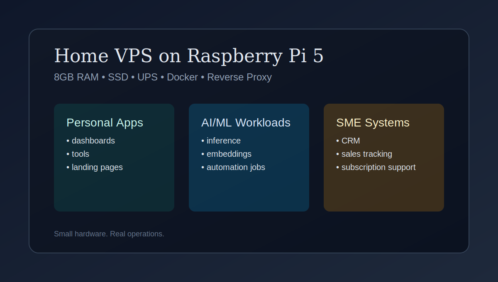
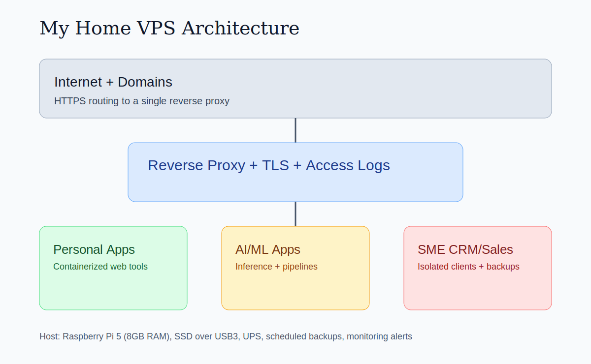
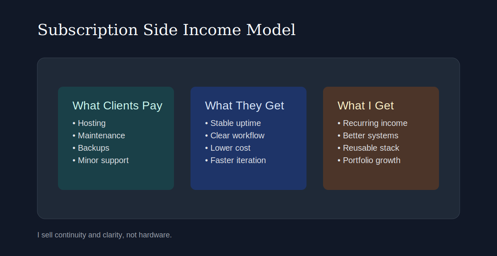

# One Raspberry Pi, Many Small Wins

Raspberry Pi တစ်လုံးကို mini hosting business တစ်ခုလို အသုံးချမယ်လို့ စကတည်းက မစဉ်းစားထားခဲ့ပါဘူး။
ကျွန်တော် လိုချင်ခဲ့တာက app အသေးလေးတွေ အတွက် cloud bill များတာကို လျှော့ချချင်တာပဲ ဖြစ်ပါတယ်။

ဒါကြောင့် Raspberry Pi 5 (8 GB RAM) တစ်လုံး၊ SSD တစ်လုံးနဲ့ "ဘယ်လောက်ထိ သုံးလို့ရမလဲ စမ်းကြည့်မယ်" ဆိုတဲ့ weekend mindset နဲ့ စခဲ့ပါတယ်။

မျှော်မှန်းထားတာထက် အများကြီး အလုပ်ဖြစ်လာခဲ့ပါတယ်။

အခုတော့ ဒီ home VPS တစ်ခုတည်းကနေ ဒီလို workload တွေကို run နေပါတယ်:

- ကျွန်တော့် personal web apps တွေ
- lightweight AI/ML apps တွေ
- home media server
- SME client အချို့အတွက် CRM နဲ့ sales management tools

ပြီးတော့ ဒီ stack ကနေ လစဉ် subscription side income တောင် ရနေပါပြီ။

## The Moment I Decided to Build It

product အသေးလေးတစ်ခု စတိုင်း pattern တစ်ခုကို ထပ်တလဲလဲ ကြုံရတယ်:

- cloud resources တွေ spin up လုပ်
- convenience အတွက် ပိုကျသင့်
- resource တွေအများစု underused ဖြစ်

ကျွန်တော်လိုချင်တာက system ကို ကိုယ်တိုင်ထိန်းချုပ်လို့ရပြီး monthly cost ကို predictable ဖြစ်နေမယ့် setup ပါ။
"free" မဟုတ်ရင်တောင် predictable ဖြစ်ရမယ်ဆိုတာပါ။

ဒါကြောင့် personal VPS ကို အိမ်မှာတင်စပြီး day one ကတည်းက serious production mindset နဲ့ ကိုင်တွယ်ခဲ့ပါတယ်။

## My Hardware (Simple but Reliable)

- Raspberry Pi 5
- 8 GB RAM
- SSD over USB 3
- broadband connection
- power stability အတွက် UPS
- active cooling case

အထူးအဆန်း hardware မဟုတ်ပါဘူး။
တကယ်ကွာခြားစေတာက hardware စျေးကြီးတာမဟုတ်ဘဲ operational discipline ပါ။

## What I Actually Run on It

### Personal Web Apps

ဒီပိုင်းကတော့ ကျွန်တော့် experiments နဲ့ utility products တွေပါ: dashboard အသေးတွေ၊ internal tools တွေ၊ landing pages တွေ၊ client prototypes တွေ။

app တစ်ခုစီကို container isolation နဲ့ သီးသန့် run ထားပါတယ်၊ env vars နဲ့ logs တွေလည်း သီးခြားထားပါတယ်။
app တစ်ခု error တက်ရင်တောင် တခြား app တွေ ဆက် run နိုင်ပါတယ်။

### AI/ML Apps

ဒီစက်ပေါ်မှာ giant model training မလုပ်ပါဘူး။
ဒီ box ကို practical AI use case တွေအတွက် သုံးထားပါတယ်:

- document parsing နဲ့ workflow automation
- knowledge base အသေးအတွက် embeddings + semantic search
- lightweight local model inference
- scheduled jobs နဲ့ integrations

benchmark score ထက် useful outcomes ကို ဦးစားပေးတဲ့အခါ Pi က တကယ်အလုပ်ဖြစ်ပါတယ်။

### Home Media Server

အစမှာ personal convenience project အဖြစ် စခဲ့တာပါ။
အခုတော့ monitoring, access control, backup routines တွေကို client apps မှာ apply မလုပ်ခင် စမ်းသပ်တဲ့ testbed ဖြစ်လာပါပြီ။

### SME CRM + Sales Systems

ဒီပိုင်းက အထူးစိတ်ဝင်စားဖို့ကောင်းတဲ့ အပိုင်းဖြစ်လာပါတယ်။

SME owner အချို့က affordable CRM နဲ့ sales tracking system တောင်းလာကြတယ်။
enterprise-level complexity မလိုဘူး။
သူတို့လိုတာက clarity ပဲ:

- customer records ကို တစ်နေရာတည်းမှာ စုစည်းထားနိုင်ဖို့
- deal stage visibility ရှိဖို့
- invoice နဲ့ follow-up tracking လုပ်လို့ရဖို့
- ယုံကြည်လို့ရတဲ့ simple reports ရဖို့

ဒီလို problem က ဒီ setup နဲ့ တော်တော်ကို fit ဖြစ်ပါတယ်။

## How I Handle Multi-Client Hosting

အလုပ်ဖြစ်ပြီး ထိန်းချုပ်ရလွယ်တဲ့ structured setup နဲ့ပဲ သွားပါတယ်:

- front door အဖြစ် reverse proxy တစ်ခု
- project/client တိုင်းအတွက် separate containers
- data isolation (DB/schema level)
- domain အားလုံးအတွက် HTTPS
- retention rule ပါတဲ့ daily backups

flashy architecture မဟုတ်ပါဘူး။
ဒါပေမယ့် မနက် ၂ နာရီ incident ဖြစ်လာရင်တောင် ကျွန်တော် maintain လုပ်နိုင်တဲ့ architecture ပါ။

## Running on 8 GB RAM: My Rules

constraint နဲ့ပဲ ရှင်သန်ရတာပါ။

- simple stack နဲ့ရတဲ့နေရာမှာ heavy framework မသုံး
- containers တွေ memory limit သတ်မှတ်
- heavy/background work တွေကို queue နဲ့ ခွဲပေး
- caching ကို aggressive လုပ်
- log rotation နဲ့ storage cleanup ကို schedule နဲ့ run
- incident မဖြစ်ခင် resource usage ကိုအမြဲကြည့်

hardware limitation ရှိတဲ့အခါ planning ပဲ performance ဖြစ်လာတယ်။

## Reliability and Security (Non-Negotiable)

subscription ပေးပြီး သုံးနေတဲ့ client ရှိလာရင် hobby project လို run လို့ မရတော့ပါဘူး။

Reliability baseline:

- uptime checks နဲ့ alerts
- auto-restart policies
- encrypted backups
- off-device backup copies

Security baseline:

- SSH keys only
- strict firewall rules
- brute-force protection
- automatic patching
- least-privilege access
- git ထဲ secrets မထည့်

ဒီ habits အသေးလေးတွေက cost ကြီးတဲ့ mistakes တွေကို ကာကွယ်ပေးပါတယ်။

## Side Income: What I Learned

service ကို monthly subscription packages အဖြစ်ပဲ ပေးပါတယ်:

- hosting
- maintenance
- backups
- minor support
- business ကြီးလာရင် upgrade path

ကျွန်တော်သင်ယူမိတာက client တွေက Raspberry Pi model ဘာလဲဆိုတာကို စိတ်မဝင်စားကြဘူး။
သူတို့စိတ်ဝင်စားတာက သူတို့ business system က stable ဖြစ်မဖြစ်၊ secure ဖြစ်မဖြစ်၊ နားလည်ရလွယ်မလွယ်ပဲ ဖြစ်ပါတယ်။

ကျွန်တော်ရောင်းတာ server မဟုတ်ပါဘူး။
continuity ကို ရောင်းတာပါ။

## Honest Limits

ဒီ setup က အောက်ပါ use case တွေအတွက် မသင့်တော်ပါဘူး:

- high-concurrency consumer platforms
- compute-heavy AI training
- strict enterprise compliance workloads

ဒါပေမယ့် personal products နဲ့ focused SME operational software အတွက်တော့ လုံလောက်သလို တန်ဖိုးလည်းကောင်းပါတယ်။

## Final Thought

ဒီ project က curiosity နဲ့ cost control လိုချင်မှုကနေ စခဲ့တာပါ။
အခုတော့ part lab, part production, part side business ဖြစ်လာပါပြီ။

Raspberry Pi 5 (8 GB) တစ်လုံး။
သေချာတဲ့ ဆုံးဖြတ်ချက်များစွာ။
real users အတွက် real value.
